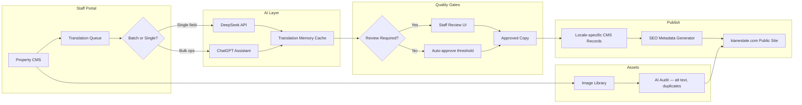
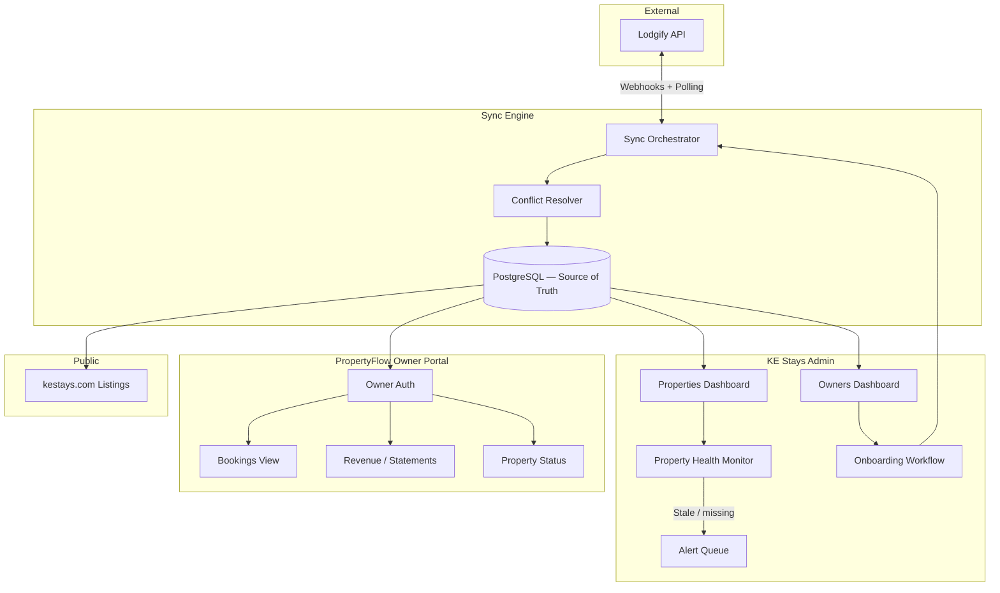
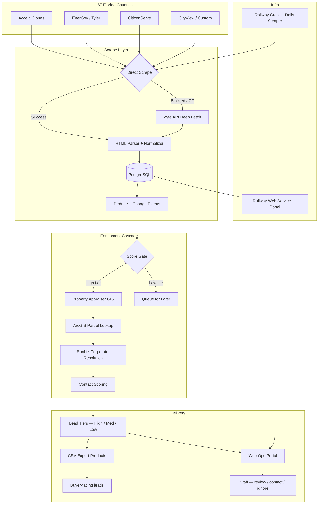

# Portfolio Content — Anders Ljungstedt

All copy for the zavian.ai one-shot portfolio. Use verbatim unless noted as placeholder.

---

## Site Meta

| Field | Value |
|-------|-------|
| **Name** | Anders Ljungstedt |
| **Title** | Applied AI Engineer |
| **Tagline** | Production LLM systems for proptech — from luxury listings to permit intelligence |
| **Location** | Oslo, Norway |
| **Primary domain** | zavian.ai |
| **Secondary domain** | anders.dev (future) |
| **Email** | anders.ljungstedt1@gmail.com |
| **Phone** | +46 761 61 38 73 |
| **LinkedIn** | https://www.linkedin.com/in/anders-ljungstedt-7a1723176/ |
| **Recruiter contact** | Via Ladda / Laddwho (Generative AI Engineer role, Oslo proptech AI company) |

---

## Hero

### Headline (split for GSAP animation)

```
Applied AI
for Proptech
that ships.
```

### Subheadline

Luxury real estate portals, vacation-rental operations, and multi-county permit intelligence — built end to end with LLMs, agents, and production-grade data pipelines.

### Hero metadata line

Oslo · zavian.ai · 8 months proptech craft with a top Gothenburg agent

### Primary CTA

View case studies → (smooth scroll to `#work`)

### Secondary CTA

Contact → (smooth scroll to `#contact`)

---

## About

### Section label

About

### Headline

From safety-critical buses to production AI in real estate.

### Body paragraphs

I'm an **Applied AI Engineer based in Oslo**, building production LLM products end to end — from APIs and data pipelines to agent orchestration and user-facing workflows. I design agentic systems (RAG, tool use, evaluation loops) and ship fullstack solutions that survive real-world failure modes: brittle extraction, cascading enrichment errors, anti-bot walls, and long-running human-in-the-loop approvals.

For the past **eight months**, I've worked hands-on with one of Gothenburg's top real estate agents — building bespoke staff portals, AI translation engines, MLS integrations, and owner-facing property management systems for **Kian Estate** (luxury Marbella) and **KE Stays** (vacation rentals). That proptech immersion sits alongside my independent work on a **Florida Lead Portal** — a Python/FastAPI platform scraping and enriching permits across 67 counties for actionable construction leads.

My background is **ISO 26262 / safety-critical systems at Volvo Buses** — the same discipline I apply to AI quality: measurable outcomes, graceful degradation, and production observability.

### Languages (display as pills)

- Native Swedish
- Fluent English
- Professional Norwegian & Danish

### Education

**Diploma, Mechatronics & Automation**  
Yrkeshögskolan Halmstad · 2020–2022  
Embedded systems, control engineering, industrial automation

---

## Case Study 01 — Kian Estate

### Meta

| Field | Value |
|-------|-------|
| **Index** | 01 |
| **Name** | Kian Estate |
| **URL** | https://www.kianestate.com/ |
| **Domain** | Luxury Marbella real estate |
| **Role** | Fullstack AI engineer — bespoke staff portal |
| **Duration context** | Part of 8-month proptech engagement |

### One-liner

Bespoke staff portal powering luxury Marbella listings — MLS import, AI translation, image automation, and ChatGPT-assisted bulk operations.

### Challenge

Kian Estate needed more than a brochure site. Their team manages high-value properties across languages and channels — importing from MLS feeds, maintaining SEO-rich listings, auditing image libraries, and producing translations at scale without hiring a full localization team.

### Solution

I built a **custom Staff Portal** integrated with their public site:

- **MLS import pipeline** — ingest property data from MLS feeds, normalize fields, and sync to the property CMS
- **AI translation engine** — DeepSeek API-powered translation workflow with review states, batch processing, and quality gates
- **Image library automation** — centralized asset management with AI audit flags for missing alt text, duplicates, and SEO gaps
- **ChatGPT integration** — "Ask ChatGPT" dropdown for bulk copy operations: descriptions, meta tags, and multilingual variants
- **Property CMS** — staff-facing CRUD for listings, status workflows, and publish-to-site pipeline
- **SEO tooling** — structured metadata, slug management, and sitemap-aware publishing

### Outcomes (bullets)

- Staff can import, translate, and publish luxury listings without developer intervention
- AI translation reduced manual copy work across EN/ES/DE/FR/NL/SV markets
- Image library audit surfaced SEO and accessibility gaps before go-live
- ChatGPT bulk ops accelerated seasonal campaign updates

### Screenshots (map to `/public/assets/`)

| Asset | Caption |
|-------|---------|
| `kianestate-overview.png` | Staff Portal — dashboard overview with property stats and quick actions |
| `kianestate-properties.png` | Properties ops view — filterable listing grid with status and MLS sync |
| `kianestate-images.png` | Images library — AI audit panel flagging SEO and duplicate issues |
| `kianestate-translations.png` | Translations workflow — DeepSeek-powered copy with Ask ChatGPT dropdown |

### Tech tags

Next.js · DeepSeek API · OpenAI ChatGPT · MLS integration · PostgreSQL · Custom CMS · SEO pipeline

### Architecture — Kian Estate Translation Pipeline



**Narrative:** Staff edits source copy in the CMS. Translations enter a queue — single fields route to DeepSeek for cost-efficient multilingual output; bulk marketing copy routes through ChatGPT for tone-aware rewrites. A translation memory cache prevents redundant API calls. High-confidence translations auto-approve; others land in a staff review UI. Approved copy flows into locale-specific CMS records, SEO metadata is generated per locale, and the public kianestate.com site renders published listings. The image library runs a parallel AI audit for accessibility and SEO before assets go live.

---

## Case Study 02 — KE Stays

### Meta

| Field | Value |
|-------|-------|
| **Index** | 02 |
| **Name** | KE Stays |
| **URL** | https://www.kestays.com/ |
| **Domain** | Vacation rental management |
| **Role** | Fullstack engineer — owner portal + admin platform |
| **Duration context** | Part of 8-month proptech engagement |

### One-liner

Dual-portal vacation rental platform — PropertyFlow owner self-service and KE Stays Admin with deep Lodgify sync, onboarding, and property health monitoring.

### Challenge

KE Stays manages vacation rentals for property owners who need transparency without calling the office. The team needed owner self-service (bookings, statements, property status) and an internal admin layer with reliable Lodgify synchronization, onboarding workflows, and health dashboards.

### Solution

- **PropertyFlow Owner Portal** — branded login portal where owners view bookings, revenue, and property status
- **KE Stays Admin** — internal dashboard for staff to manage owners, properties, and sync state
- **Lodgify deep sync** — bidirectional property, calendar, and booking sync with conflict detection
- **Owner onboarding** — guided setup flow: property details, payout info, portal credentials
- **Property health monitoring** — sync status, missing data flags, and stale listing alerts

### Outcomes (bullets)

- Owners self-serve via PropertyFlow without support tickets for routine queries
- Admin team sees sync health across all properties in one dashboard
- Lodgify deep sync reduced manual data entry and calendar drift
- Onboarding flow cut time-to-live for new owner properties

### Screenshots

| Asset | Caption |
|-------|---------|
| `kestays-owner-portal-login.png` | PropertyFlow — owner login portal with KE Stays branding |
| `kestays-admin-owners.png` | KE Stays Admin — owners dashboard with onboarding status |
| `kestays-admin-properties.png` | KE Stays Admin — properties view with Lodgify sync health |

### Tech tags

Next.js · Lodgify API · PostgreSQL · Owner auth · Sync jobs · Admin dashboard

### Architecture — KE Stays Lodgify Sync + Owner Portal



**Narrative:** Lodgify is the channel manager of record. A sync orchestrator pulls webhooks and runs scheduled polls to keep PostgreSQL as the source of truth. A conflict resolver handles calendar overlaps and field mismatches. KE Stays Admin surfaces owner onboarding, property health, and sync alerts. PropertyFlow gives owners a filtered, branded view of their own data — bookings, revenue, and status — without exposing internal admin tools. Published listing data flows to kestays.com.

---

## Case Study 03 — Florida Lead Portal

### Meta

| Field | Value |
|-------|-------|
| **Index** | 03 |
| **Name** | Florida Lead Portal |
| **URL** | zavian.ai (portfolio reference) |
| **Domain** | Construction permit intelligence |
| **Role** | Solo architect & engineer — scrape → enrich → score → portal |
| **Repo** | This repository (Python/FastAPI) |

### One-liner

Multi-county permit intelligence platform — scraping 67 Florida counties via Zyte API, enriching with GIS and corporate data, scoring leads, and serving them through a Railway-hosted ops portal.

### Challenge

Florida construction leads are buried in fragmented county permit portals — Accela, EnerGov, CitizenServe, CityView, and dozens of custom systems. Each has different HTML, anti-bot measures, and data quality. Turning raw permits into **contactable, scored leads** requires a production pipeline, not a one-off scraper.

### Solution

- **67-county coverage map** — wired adapters for Accela clones, EnerGov, CitizenServe, and custom portals with priority-tier rollout
- **Zyte API integration** — headless browser fetch for Cloudflare/Turnstile-protected Accela portals when direct scrape fails
- **Scrape → parse → dedupe** — normalized records in PostgreSQL with partial unique indexes and change-event tracking
- **Enrichment cascade** — permit record → Property Appraiser GIS (ArcGIS) → Sunbiz corporate resolution → contact scoring
- **Lead scoring** — tiered classification (high / medium / low) with score-gated enrichment to control API costs
- **Railway cron** — daily scraper worker + separate web portal service on shared Postgres
- **Ops UI** — review leads, mark contacted/ignored/saved, manage users, export CSV products

### Outcomes (bullets)

- 50+ Florida county permit sources in production pipeline
- RAG-style enrichment cascade turned uncontactable records into actionable leads
- Zyte deep-fetch recovered high-value failures behind Cloudflare walls
- Score-gated enrichment and duplicate prevention via DB-layer partial unique indexes
- Observable retry loops and ghost-lead recovery jobs for production reliability

### Screenshots

No dedicated portal screenshots in this package — use architecture diagram and tech narrative. Optional: generate a stylized "ops dashboard" placeholder card with pipeline stats (67 counties · daily cron · Postgres).

### Tech tags

Python · FastAPI · Scrapy · Zyte API · PostgreSQL · Alembic · Railway · ArcGIS · Sunbiz · Lead scoring

### Architecture — Florida Lead Portal Pipeline



**Narrative:** County adapters target Accela, EnerGov, CitizenServe, and custom portals across Florida's 67 counties. Direct Scrapy/Playwright scrape is attempted first; Cloudflare-blocked Accela portals fall back to Zyte API browser fetch. Parsed records normalize into PostgreSQL with deduplication and change-event tracking. Enrichment is score-gated: high-tier leads get Property Appraiser GIS lookup via ArcGIS, Sunbiz corporate resolution, and contact scoring. Outputs feed CSV export products and a Railway-hosted ops portal where staff review, contact, or ignore leads. A daily cron worker keeps the pipeline fresh.

---

## Architecture Highlights Section

### Section label

Architecture

### Headline

Pipelines designed for real-world failure modes.

### Three highlight cards

**1. Enrichment cascades**  
Permit → GIS parcel → corporate entity → contact score. Each stage has fallbacks, retry policies, and quality gates so one brittle source doesn't poison the pipeline.

**2. Agent orchestration**  
Jira AI Factory: LangGraph state machines, MCP tool boundaries (Jira, Slack), PostgreSQL checkpointing — agents pause for human approval and resume without holding compute.

**3. Anti-bot resilience**  
Session rotation, proxy routing, Zyte deep-fetch, observable retry loops. Production scrapers that save raw HTML on failure instead of faking success.

---

## Skills & Tech Section

### Section label

Capabilities

### Headline

What I bring to a generative AI engineer role.

### Skill clusters

**LLMs & NLP**  
Anthropic Claude · OpenAI · DeepSeek · Prompt engineering · Structured outputs · Tool calling

**RAG & Retrieval**  
Enrichment cascades · Entity resolution · GIS/corporate data · Dedupe at DB layer

**Agents & Orchestration**  
LangGraph · ReAct · MCP (Jira, Slack) · Checkpointed / dormant workflows · HITL in Slack

**AI Quality & Evaluation**  
Retry policies · Lead scoring · Regression fixtures · Before/after metrics

**AI Platforms**  
Anthropic API · Railway + Postgres · Cloud AI patterns (Azure / Vertex)

**Engineering**  
Python · FastAPI · Next.js · Scrapy · PostgreSQL · Alembic · Async jobs · Ops UI

**Proptech domain**  
MLS integration · Luxury listings CMS · Vacation rental sync · Permit intelligence · Multilingual SEO

**Safety & discipline**  
ISO 26262 background · FMEA/TARA mindset · Graceful degradation · Production observability

---

## Professional Experience (condensed for footer or About expand)

### Generative AI Engineer & System Architect
**repforce.ai / Independent Consultant** · Oct 2025 – Present · Oslo / Remote

- Built **Jira AI Factory**: LLM orchestration over MCP, LangGraph, PostgreSQL checkpointing
- End-to-end **Florida permit platform** across 50+ county sources
- Scoped non-human agent identities at MCP boundaries

### System Architect Engineer
**Volvo Buses, Gothenburg** · Sep 2024 – Jan 2026

- Safety-critical vehicle platforms (ISO 26262, UNECE R155/R156)
- FMEA, TARA, supplier integration

### Systems & Validation Engineer
**Volvo Buses, Gothenburg** · Jan 2023 – Aug 2024

- ECU application software · SIL/HIL validation · Arctic field testing (−40°C)

---

## Contact CTA

### Section label

Contact

### Headline

Let's build proptech AI that ships.

### Body

I'm based in **Oslo** and exploring a **Generative AI Engineer** role with a proptech AI company. Reach out directly or via **Ladda / Laddwho**.

### Links

- **Email:** anders.ljungstedt1@gmail.com
- **LinkedIn:** linkedin.com/in/anders-ljungstedt-7a1723176
- **Portfolio:** zavian.ai

### Footer line

© 2026 Anders Ljungstedt · zavian.ai

---

## Navigation Labels

- Work (→ `#work` case studies)
- About (→ `#about`)
- Architecture (→ `#architecture`)
- Contact (→ `#contact`)

---

## SEO

**Title:** Anders Ljungstedt — Applied AI Engineer · Proptech · Oslo

**Description:** Production LLM systems for luxury real estate and permit intelligence. Kian Estate, KE Stays, Florida Lead Portal. Oslo-based Applied AI Engineer available via Ladda.

**OG image:** Use `kianestate-overview.png` or a composite hero frame.

---

## Copy Do-Nots

- Do not claim employment at Kian Estate or KE Stays — frame as consultancy / bespoke build engagement
- Do not invent metrics (e.g. "40% faster") unless added by user later
- Do not use "revolutionary" or "cutting-edge" — let the work speak
- User-agent / portfolio references zavian.ai, not anders.dev (future)
